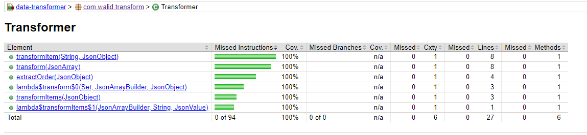

# JSON Data Transformer

## Overview
This is a java 8 application that accepts a and transforms a valid JSON transactions file `data.json` producing a new output file `data-transformed.json`. Input file is expected to exist in the current directory and output file will be created in there as well.

## Main Features
- A simple JSON transformation implementation based on native JSON Processing API [JSON-P](https://javaee.github.io/jsonp/) as a light-weight fit-for-purpose JSON streaming and transformation framework.
- Logs are generated to STDOUT.
- Gralde used to manage dependencies and generate the uber JAR.
- Junit used to create Unit/Integration tests.
- JaCoCo used to measure and generate test coverage report.

## Synopsis
To build (package) the uber JAR
```bash
$ ./gradlew clean build
<-------------> 0% EXECUTING [118mms]
<=------------> 7% EXECUTING [216ms]
><======-------> 46% EXECUTING [309ms]
<=========----> 69% EXECUTING [512ms]
<=========----> 69% EXECUTING [606ms]
> <=========----> 69% EXECUTING [804ms]
    <=========----> 69% EXECUTING [1s]
;1m=========----> 69% EXECUTING [710ms]
>
BUILD SUCCESSFUL in 5s
8 actionable tasks: 8 executed
```
To run the application
```bash
$ java -jar build/libs/data-transformer-1.0.0.jar
[Fri. Jul. 29 12:25:50 AEST 2022] INFO: Reading input from ./data.json and writing output to ./data-transformed.json
[Fri. Jul. 29 12:25:50 AEST 2022] INFO: All done!
$
```

## Test Coverage Report
